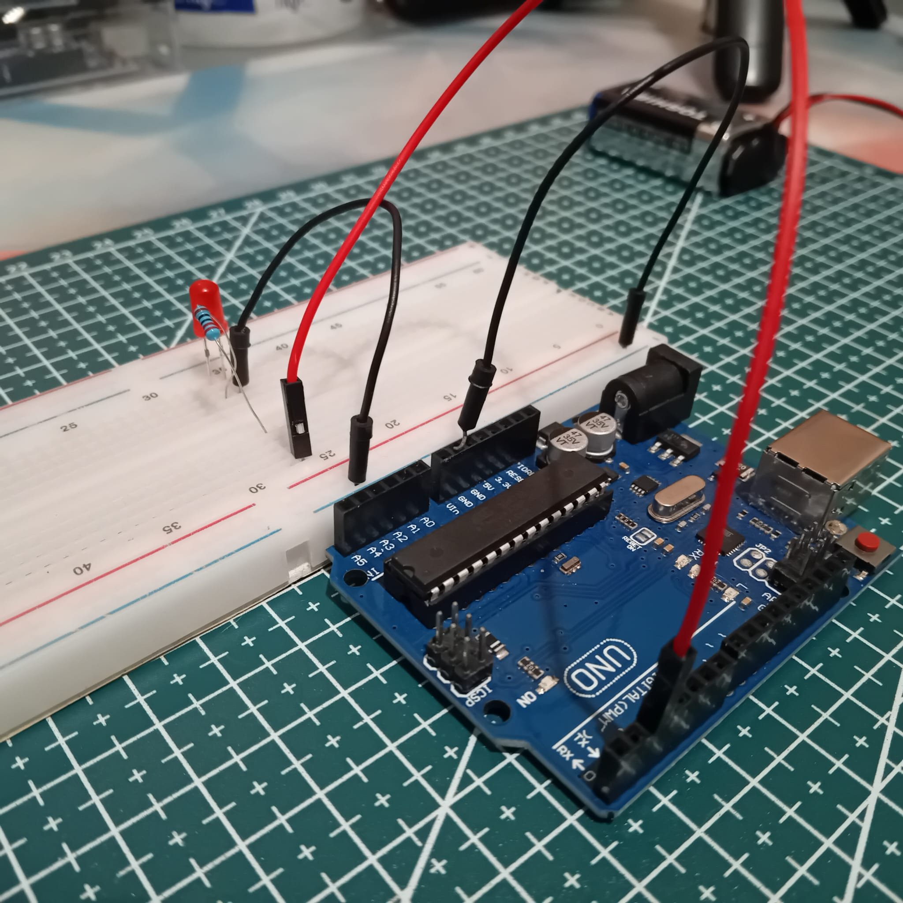
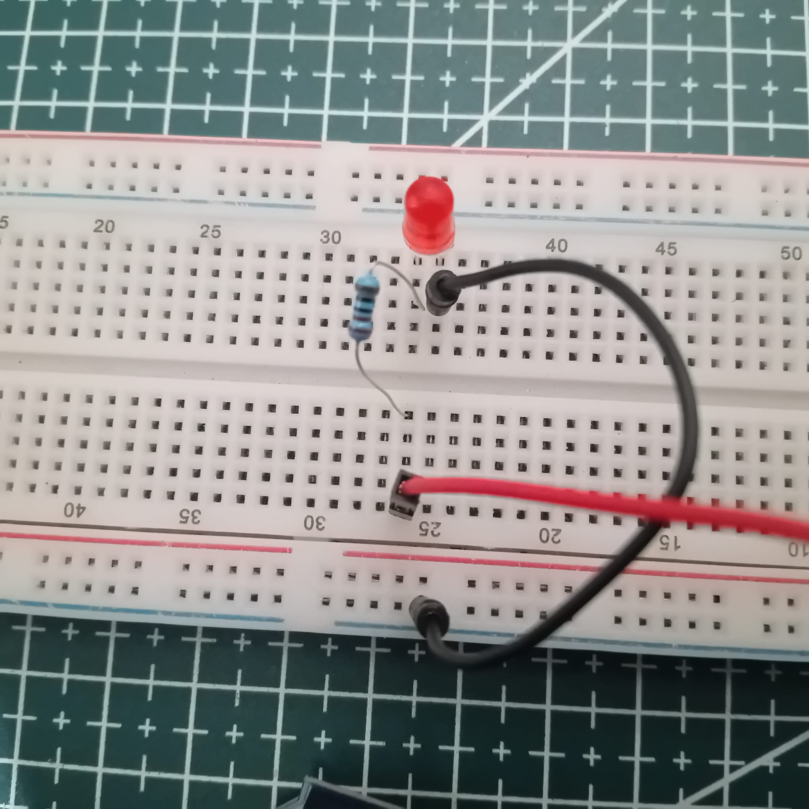
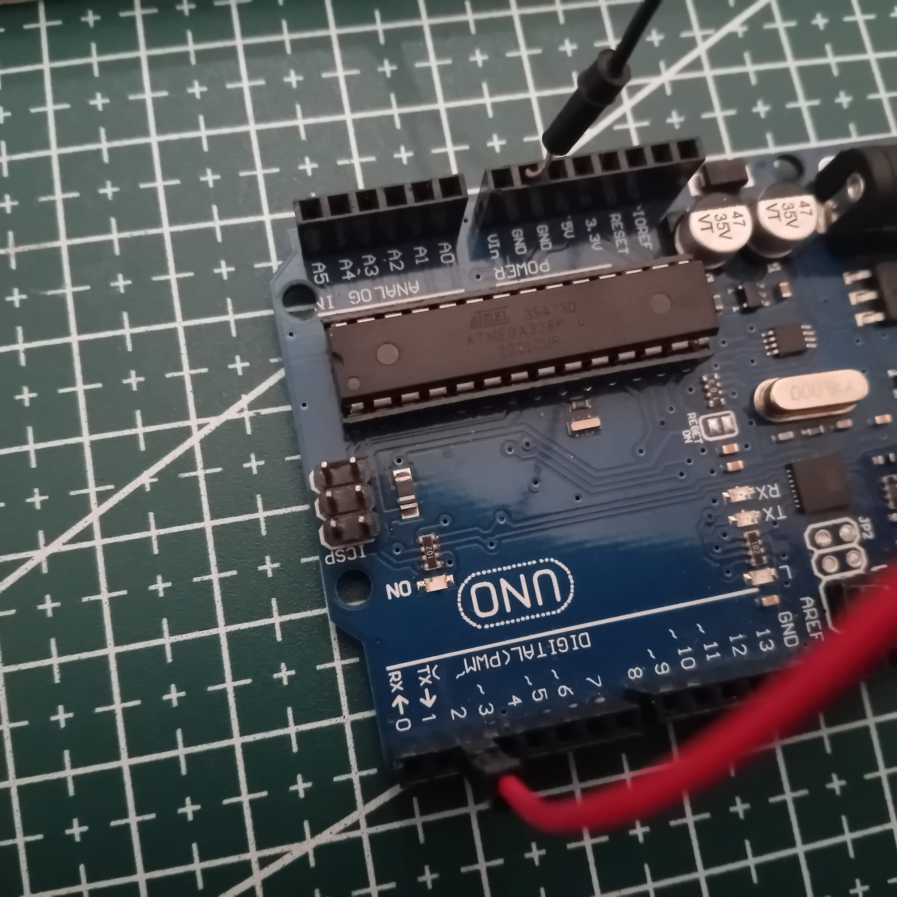

# ARDUINO-BASICS
Here u go find some arduino basics

## 1.Blinking LED with Arduino 🚨
This project demonstrates how to blink an LED using an Arduino. The LED connected to pin 2 will turn ON and OFF every second.

### Component Required
- Arduino board (e.g., Uno, Mega, Nano)
- LED
- Resistor (220Ω recommended)
- Jumper wires
- Breadboard (optional)
  
### Circuit Diagram
- Connect the positive leg (anode) of the LED to digital pin 2 of the Arduino.
- Connect the negative leg (cathode) of the LED to one end of a 220Ω resistor.
- Connect the other end of the resistor to GND (ground) on the Arduino.





### Code
```cpp
// VARIABLE/CONSTANT DECLARATION
const int LED = 2;

// SET LED AS OUTPUT
void setup() {
  pinMode(LED, OUTPUT);
}

// FUNCTION TO BLINK LED (ON-OFF EVERY 1 SECOND)
void piscaLed(int thing) {
  digitalWrite(thing, HIGH);
  delay(1000);
  digitalWrite(thing, LOW);
  delay(1000);
}

// CALLING FUNCTION INSIDE THE LOOP
void loop() {
  piscaLed(LED);
}
````

### Explanation
- Declaring the LED pin: The LED is assigned to pin 2.
- Setup function: The pin is configured as an OUTPUT.
- Blink function: The function piscaLed() turns the LED ON for 1 second, then OFF for 1 second.
- Loop function: Calls piscaLed(LED); continuously to keep the LED blin

### How to use
- Copy the above code into the Arduino IDE.
- Connect the Arduino board to your computer via USB.
- Select the correct board and port in the Arduino IDE.
- Click Upload to flash the code onto the Arduino.
- The LED should start blinking every second.

### Customization
- Change the LED pin by modifying const int LED = X;.
- Adjust the blink interval by changing the delay(1000); value.

### License
This project is open-source. Feel free to modify and distribute it!
